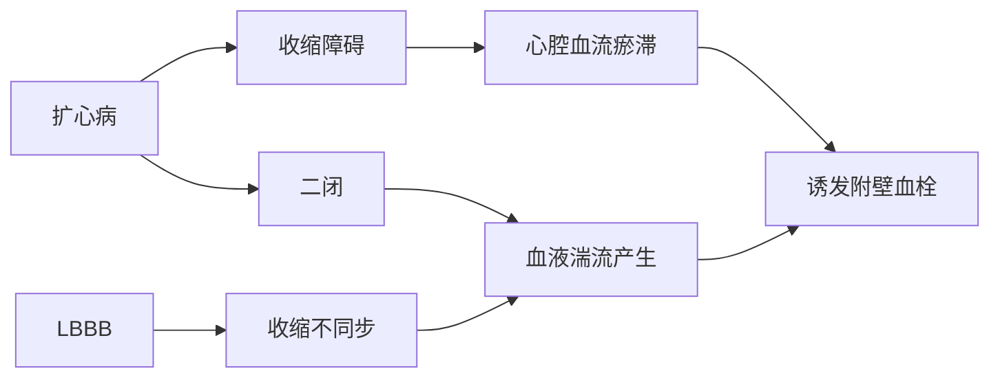

# Q
 64 岁，男性病人，因间断胸闷两年，加重1个月人院，既往高血压6年，自行服用氨氯地平血压控制于 120/80mmHg。体检示 BP 100/80mmHg，心率120 次/min，心界向左下明显扩大，心音低钝，心律齐，心尖部可闻及收缩期杂音，双下肺可闻及湿啰音，心电图提示完全性左束支传导阻滞。该病人住院期间突发意识不清，恶心，呕吐，头痛，偏瘫。体检示颈强，血压 160/100mmHg。首先考虑的诊断为

A. 脑栓塞 
B. 急性脑梗死 
C. 脑膜炎
D. 高血压脑病 
E. 颈椎病
# A
A
# D
